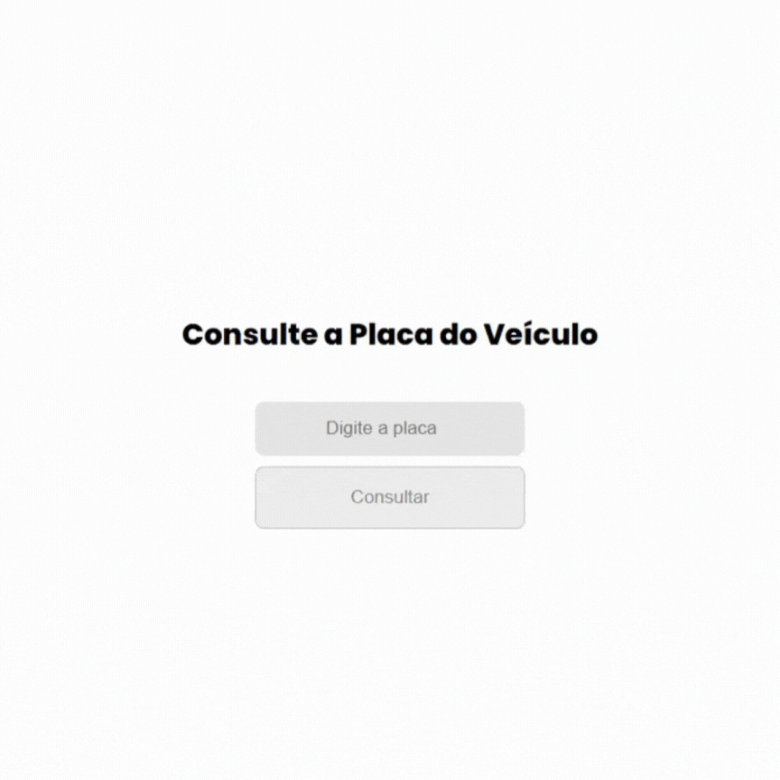

# Projeto de Consultar Placas
Após detectar uma sequência de furtos em casas no meu bairro, criamos um grupo e começamos a desconfiar de todos os veículos que não conhecíamos. Para facilitar a detecção dos mesmos, criei esse sistema, onde podemos verificar se a placa pertence a um morador ou não.

